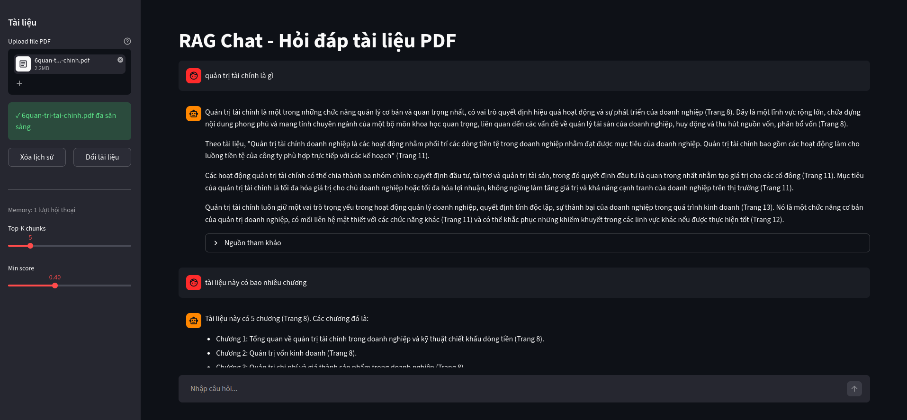

# RAG Basic — Hệ thống hỏi đáp tài liệu PDF

Hệ thống RAG (Retrieval-Augmented Generation) đơn giản, cho phép hỏi đáp dựa trên tài liệu PDF bằng tiếng Việt. Sử dụng **BGE-M3** để embedding và **Gemini** để sinh câu trả lời

---

## Kiến trúc

```
PDF → [Indexer] → ChromaDB
                      ↓
Câu hỏi → [Memory] → [Rephrase] → [Retriever] → Top-K chunks → [Generator] → Câu trả lời
                                                                                     ↓
                                                                               Lưu vào Memory
```

| Bước | Module | Chức năng |
|------|--------|-----------|
| 1 | `indexer.py` | Đọc PDF → chia chunks → embedding → lưu ChromaDB |
| 2 | `retriever.py` | Nhận câu hỏi → tìm chunks liên quan nhất |
| 3 | `generator.py` | Ghép context + prompt → gọi Gemini → trả lời |
| 4 | `chat_history.py` | Quản lý memory hội thoại nhiều lượt |
| 5 | `app.py` | Giao diện web Streamlit |

---

## Cấu trúc thư mục

```
rag/
├── .env                  # API key (không commit lên git)
├── config.py             # Cấu hình tập trung
├── indexer.py            # Bước 1: xây dựng vector DB
├── retriever.py          # Bước 2: tìm kiếm chunks
├── generator.py          # Bước 3: sinh câu trả lời
├── chat_history.py       # Bước 4: quản lý memory
├── app.py                # Giao diện Streamlit
├── main.py               # CLI chat interactive
├── documents/
│   └── your_file.pdf     # File PDF cần hỏi đáp
└── chromadb/             # Vector DB (tự sinh, không commit)
```

---

## Cài đặt

### 1. Clone và tạo môi trường ảo

```bash
git clone https://github.com/coderiukl/RAGs.git
cd rag
python -m venv venv
source venv/bin/activate        # Linux/Mac
venv\Scripts\activate           # Windows
```

### 2. Cài thư viện

```bash
pip install pymupdf \
            sentence-transformers \
            chromadb \
            langchain-text-splitters \
            google-generativeai \
            python-dotenv \
            streamlit
```

### 3. Lấy Gemini API key

Truy cập [aistudio.google.com](https://aistudio.google.com) → lấy API key miễn phí.

### 4. Tạo file `.env`

```env
GEMINI_API_KEY=your_api_key_here
```

---

## Cấu hình (`config.py`)

```python
COLLECTION_NAME = "rag_basic"        # tên collection trong ChromaDB
EMBED_MODEL     = "BAAI/bge-m3"      # model embedding
GEMINI_MODEL    = "gemini-2.5-flash" # model LLM
TOP_K           = 10                 # số chunks trả về mỗi truy vấn
MIN_SCORE       = 0.4                # ngưỡng similarity tối thiểu (0~1)
PDF_PATH        = "./documents/your_file.pdf"
```

---

## Sử dụng

### Cách 1 — Giao diện web (khuyến nghị)

```bash
streamlit run app.py --server.fileWatcherType none
```

Mở trình duyệt tại `http://localhost:8501`



**Luồng sử dụng:**
1. Upload file PDF ở sidebar bên trái
2. Nhấn **Bắt đầu Index** — chờ progress bar hoàn tất
3. Gõ câu hỏi vào ô chat bên dưới
4. Xem câu trả lời kèm nguồn tham khảo
5. Hỏi tiếp — memory tự động nhớ ngữ cảnh

**Các nút điều khiển ở sidebar:**
- `Top-K chunks` — số đoạn văn tìm kiếm (3–15)
- `Min score` — ngưỡng lọc kết quả (0.1–0.9)
- `Xóa lịch sử` — reset memory, giữ nguyên tài liệu
- `Đổi tài liệu` — upload PDF khác

### Cách 2 — CLI terminal

```bash
# Bước 1: Index tài liệu (chạy 1 lần)
python indexer.py

# Bước 2: Hỏi đáp interactive
python main.py
```

```
RAG system ready. Type 'quit' to exit.

Question: Quản trị tài chính là gì?

Quản trị tài chính là quá trình lập kế hoạch, tổ chức, điều hành
và kiểm soát các hoạt động tài chính của doanh nghiệp (Trang 5).
Mục tiêu chính là tối đa hóa giá trị doanh nghiệp (Trang 8).

Nguồn
Trang 5 - score: 0.8234
Trang 8 - score: 0.7651
```

> Lần đầu sẽ tải BGE-M3 (~2GB). Từ lần sau dùng cache.

### Cách 3 — Chạy từng module riêng (test)

```bash
python retriever.py   # test tìm kiếm
python generator.py   # test sinh câu trả lời
```

---

## Chat History (Memory)

Hệ thống sử dụng **short-term memory** để hỏi đáp nhiều lượt tự nhiên. Câu hỏi thiếu ngữ cảnh sẽ được tự động rephrase trước khi tìm kiếm.

**Ví dụ:**
```
Bạn:    Quản trị tài chính là gì?
Trợ lý: Quản trị tài chính là... (Trang 5)

Bạn:    Nó có mấy mục tiêu?
         ↓ rephrase tự động
         "Quản trị tài chính có mấy mục tiêu?"
Trợ lý: Có 3 mục tiêu chính... (Trang 8)
```

**Cấu hình memory trong `chat_history.py`:**

```python
ChatHistory(max_turns=5)  # nhớ 5 lượt hội thoại gần nhất
```

| `max_turns` | Dùng khi |
|-------------|----------|
| `3` | Tiết kiệm token, hội thoại ngắn |
| `5` | Mặc định — cân bằng tốt |
| `10` | Hội thoại dài, cần nhớ nhiều ngữ cảnh |

**Lệnh CLI:**
```
quit / exit / q  — thoát
clear            — xóa memory, bắt đầu hội thoại mới
```

---

## Tìm kiếm nâng cao

`retriever.py` hỗ trợ 2 chế độ:

```python
# Semantic search thuần (mặc định)
chunks = retrieve("quản trị tài chính là gì")

# Hybrid: semantic + bắt buộc có từ khóa
chunks = retrieve("quản trị tài chính là gì", keyword="quản trị")
```

---

## Điều chỉnh chất lượng

| Tham số | Mặc định | Tăng khi nào |
|---------|----------|--------------|
| `TOP_K` | 10 | Cần nhiều context hơn |
| `MIN_SCORE` | 0.4 | Muốn lọc chặt hơn (thử 0.5~0.6) |
| `chunk_size` | 500 | Tài liệu có đoạn văn dài |
| `chunk_overlap` | 100 | Hay bị mất ngữ cảnh giữa chunks |
| `max_turns` | 5 | Hội thoại dài cần nhớ nhiều |

**Score tham khảo:**
- `> 0.7` — rất liên quan
- `0.5 ~ 0.7` — liên quan vừa
- `< 0.4` — nên bỏ qua

---

## Stack công nghệ

| Thành phần | Thư viện | Ghi chú |
|------------|----------|---------|
| Đọc PDF | `pymupdf` | Hỗ trợ tốt tiếng Việt |
| Chia chunks | `langchain-text-splitters` | RecursiveCharacterTextSplitter |
| Embedding | `sentence-transformers` + `BAAI/bge-m3` | 1024 chiều, đa ngôn ngữ |
| Vector DB | `chromadb` | Lưu local, không cần server |
| LLM | `google-generativeai` (Gemini) | Free tier |
| Memory | `chat_history.py` | Short-term memory, rephrase query |
| UI | `streamlit` | Giao diện web local |

---

## Kiểm tra dữ liệu sau khi index

```python
import chromadb

client = chromadb.PersistentClient()
collection = client.get_collection("rag_basic")

print(f"Tổng chunks: {collection.count()}")

sample = collection.get(limit=1, include=["documents", "metadatas", "embeddings"])
print(f"Embedding chiều: {len(sample['embeddings'][0])}")  # phải là 1024
print(f"Sample: {sample['documents'][0][:100]}")
```
